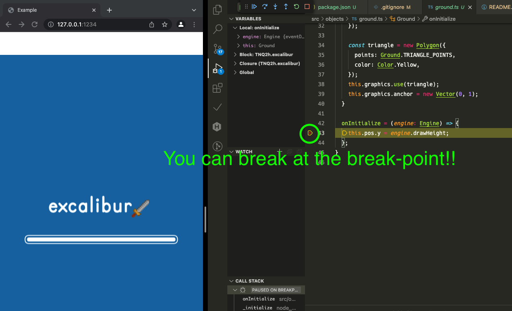

# excalibur-parcel2-vscode-debuggable-template

This repository is **Deprecated** .
Please use
[Vite template](https://github.com/tenpaMk2/excalibur-vite-vscode-debuggable-template)
instead.

---

Excalibur.js Parcel2 VSCode debuggable template.

## Credits

|      item (description)      |   author    | URL                                                    |
| :--------------------------: | :---------: | :----------------------------------------------------- |
| character graphics for demo  |  kenny.nl   | <https://www.kenney.nl/>                               |
|      original template       | excaliburjs | <https://github.com/excaliburjs/template-ts-parcel-v2> |
| original Parcel issue thread |      -      | <https://github.com/parcel-bundler/parcel/issues/611>  |
